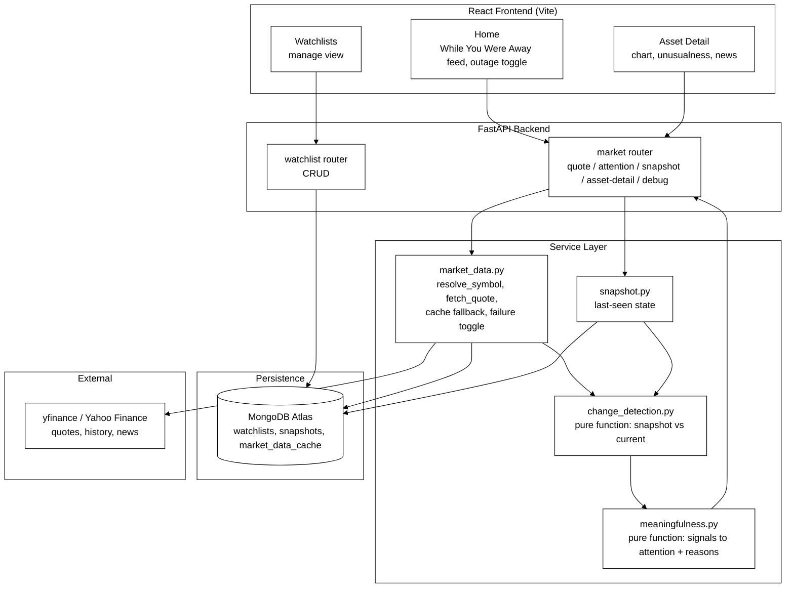

# Architecture — Groww Signal

## System diagram

**Reading the diagram:** the three frontend views each call one of two routers. The Watchlist router talks directly to MongoDB for CRUD. The Market router is where the real logic lives — it calls Market Data (which resolves the symbol, fetches live from Yahoo Finance or falls back to the MongoDB cache) and Snapshot (which reads what the user last saw, also from MongoDB). Both outputs feed into Change Detection, which feeds into the Meaningfulness Engine, whose result flows back through the Market router to the frontend.

`change_detection.py` and `meaningfulness.py` are **pure functions with zero I/O** — plain dicts in, plain dicts out, no database or network calls inside either one. This is deliberate: they encode the actual product judgment (what counts as "meaningful"), so they needed to be testable in isolation without mocking anything. `backend/tests/` unit-tests exactly these two modules.

## Request flow: "what deserves my attention?"

1. Frontend calls `GET /market/attention/{user_id}/{symbol}`
2. `market_data.fetch_quote()` resolves the symbol (alias/rename table), then either fetches live from `yfinance` or serves the cached "last known good" quote if live fetch fails or the outage toggle is on
3. `snapshot.get_last_snapshot()` reads what this user last saw for this symbol from MongoDB
4. `change_detection.detect_changes()` — a pure function — computes `price_delta_pct` and `volume_ratio` between the snapshot and current quote (no judgment yet)
5. `market_data.fetch_sector_and_index()` gets the current Nifty move for market-context comparison
6. `meaningfulness.classify_attention()` — a pure function — turns those raw signals into `attention: high/notable/routine` plus an explicit `reasons[]` list
7. Response combines all of it; frontend renders the attention badge, the reasons, and (on Asset Detail) the unusualness stat and news timeline

## How this maps to the judging criteria

### Engineering Depth — architecture, correctness, reliability, scalability
- Four distinct layers (data adapter → snapshot → change detection → meaningfulness) instead of one function doing everything — each layer is independently testable and replaceable
- `refreshAttention()` on the frontend fetches all watchlist items' attention data **in parallel** (`Promise.all`) rather than sequentially, so the UI stays responsive as a watchlist grows — a direct answer to "how does the system scale for larger watchlists"
- Quotes are cached in MongoDB on every successful fetch specifically so a later failure has something to fall back to — reliability isn't bolted on, it's a side effect of the normal write path
- Unit tests (`backend/tests/`) cover the two pure functions that encode the actual business logic, so the riskiest code has the most direct test coverage

### Product & Problem Interpretation — understanding beyond the obvious brief
- The brief asks for "meaningful change" — this build explicitly rejects a flat percentage threshold. `meaningfulness.py` requires **two independent signals** (price move, volume spike, or divergence from Nifty) before something is flagged `high`, and **one** signal for `notable`. A single number moving isn't enough on its own
- Market context (stock's move vs. Nifty's move) is folded into the classification, so a stock moving 3% on a day the whole market moved 3% is treated differently from a stock moving 3% alone
- The Asset Detail "unusualness" stat compares today's move to that **specific stock's own** 30-day average move — a stock that normally swings 4%/day isn't flagged the same way as one that normally moves 0.5%/day

### Edge Cases & Resilience — failures, race conditions, integrity, unreliable dependencies
- **Live-demoable failure simulation**: `POST /market/debug/simulate-failure` flips a server flag that forces every quote through the cache-fallback path, so the fallback behavior can be *shown*, not just claimed, without physically breaking the network
- **Last-known-good cache**: every quote fetch failure falls back to the most recent successful quote for that symbol, tagged `data_quality: stale`, with the underlying error preserved in `fetch_error`
- **First-view handling**: `change_detection.py` explicitly checks `is_first_view` so a stock with no prior snapshot is never incorrectly flagged as having "changed" on its first-ever fetch
- **Renamed/aliased tickers**: `resolve_symbol()` handles real-world data integrity issues like Zomato's ticker changing from `ZOMATO.NS` to `ETERNAL.NS`, and common-name aliases (`INFOSYS` → `INFY.NS`) so a reasonable user input doesn't silently fail
- **Graceful degradation on Asset Detail**: unusualness calculation and news fetching are each wrapped in their own `try/except`; if Yahoo Finance's news endpoint fails or returns nothing, the rest of the Asset Detail page (price, chart, quote) still renders correctly
- **Explicit "not found" state**: a genuinely unresolvable symbol renders a distinct "Stock not found" UI state rather than a blank page or a generic error

### Code Quality & Simplicity — maintainability without over-engineering
- Routers stay thin (HTTP concerns only); all logic lives in `services/`, importable and testable without spinning up FastAPI
- No ORM, no unnecessary abstraction — PyMongo used directly since the data model (three flat collections) doesn't need one
- The frontend is intentionally a single `App.jsx` rather than split into a deep component tree — given the 72-hour scope, one file that's easy to read top-to-bottom beat a "correct" folder structure that would cost time without adding clarity at this size
- Nav items for Explore / Alerts / Insights / News / Settings exist in the UI shell but are explicitly unimplemented placeholders rather than half-built features — scope was kept honest rather than padded

### Originality & Thoughtfulness — independent choices, considered approach
- **Deterministic rules over ML for meaningfulness** — a considered rejection of the "obvious" AI angle, explained in `DECISIONS.md`
- **"While You Were Away" framing** instead of a generic dashboard — the product's entire information architecture is built around the return-visit comparison, not just a live ticker
- **The outage toggle is a demo feature, not a debugging leftover** — it was built specifically so a judge can verify the resilience claim themselves in 10 seconds, rather than taking the README's word for it
